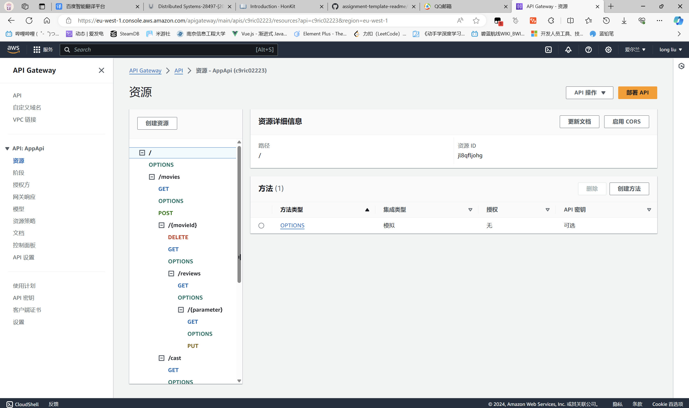
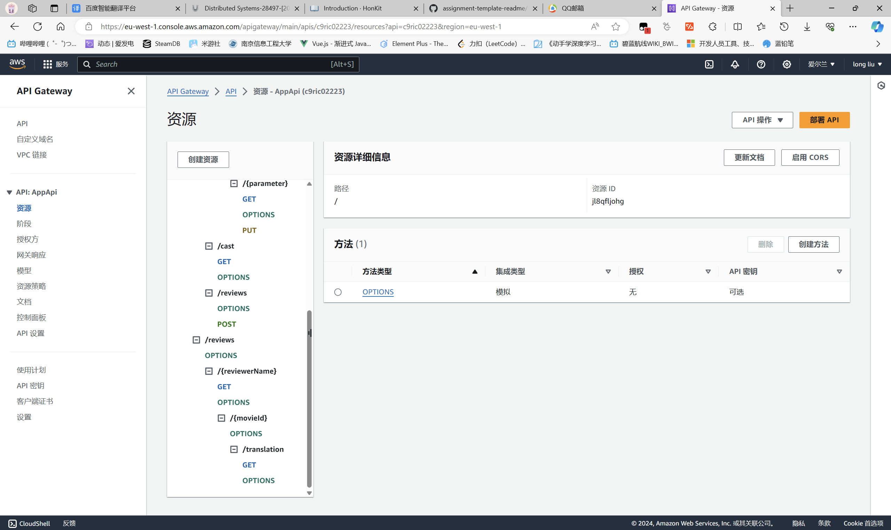
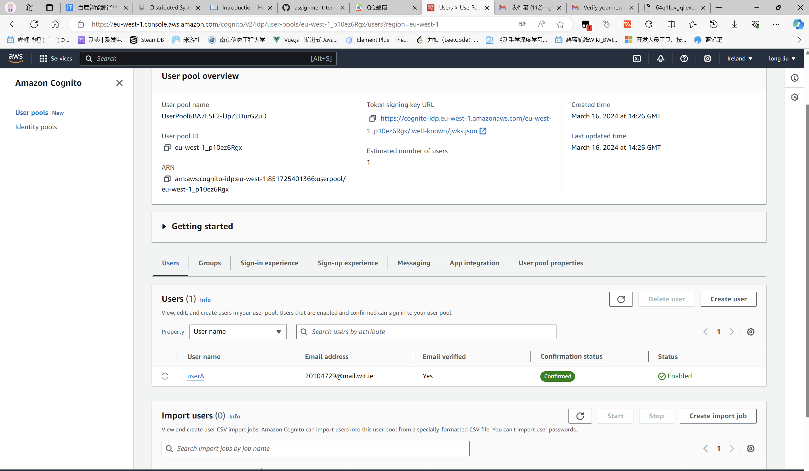
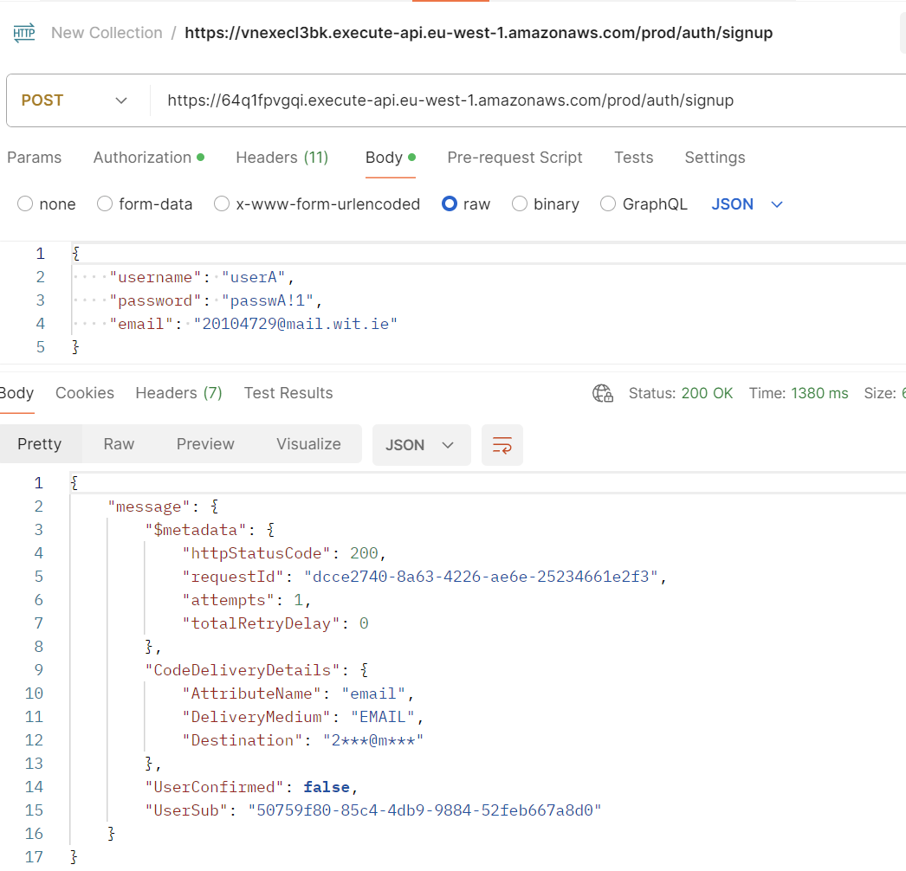
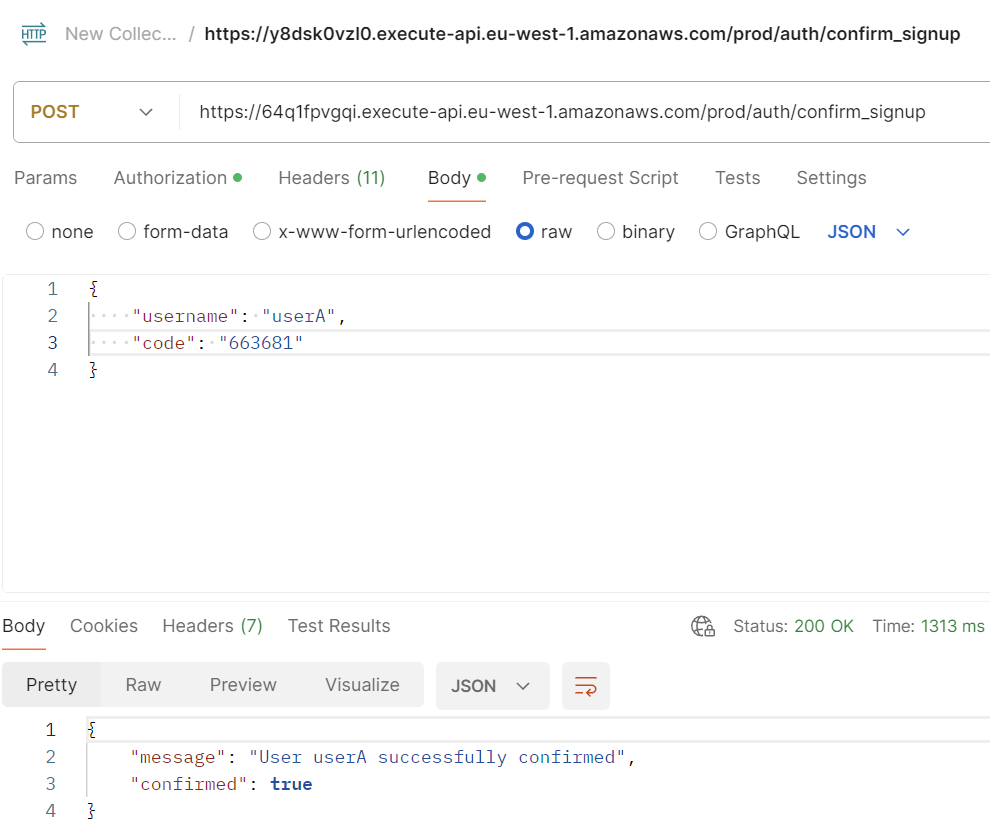
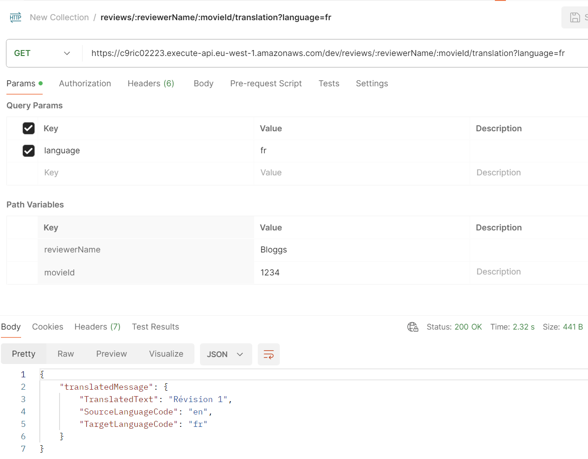

## Serverless REST Assignment.

__Name:__ Long Liu

__Video demonstration:__ https://youtu.be/TOrxF3E3zEg

This repository contains an implementation of a serverless REST API for the AWS platform. The CDK framework is used to provision its infrastructure. The API's domain context is movie reviews.

### API endpoints.

+ POST /movies/reviews - add a movie review.
+ GET /movies/{movieId}/reviews - Get all the reviews for the specified movie.
+ GET /movies/{movieId}/reviews?minRating=n - Get the reviews for the specified movie with a rating greater than the minRating.
+ GET /movies/{movieId}/reviews/{reviewerName} - Get the review written by the named reviewer for the specified movie.
+ PUT /movies/{movieId}/reviews/{reviewerName} - Update the text of a review.
+ GET /movies/{movieId}/reviews/{year} - Get the reviews written in a specific year for a specific movie.
+ GET /reviews/{reviewerName} - Get all the reviews written by a specific reviewer.
+ GET /reviews/{reviewerName}/{movieId}/translation?language=code - Get a translated version of a movie review using the movie ID and reviewer name as the identifier.

### Authentication

### Independent learning 

#### Amazon Translate

I complete the amazon translate function. Using the translate Api to translate reviews and giving the function enough permission to use translate api. The evidence source file is `getTranslatedReview.ts`

